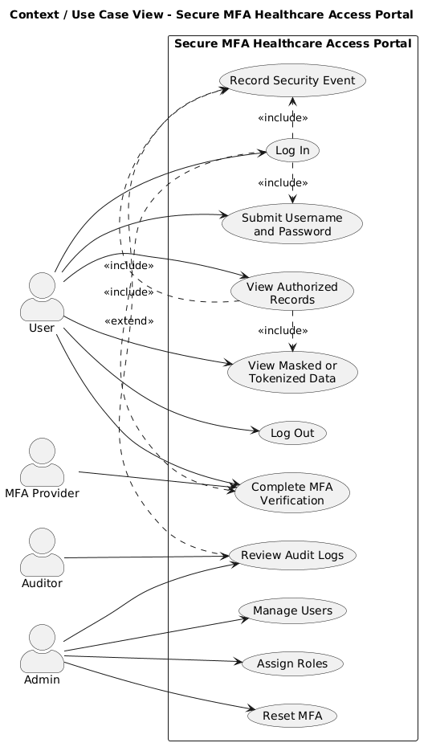
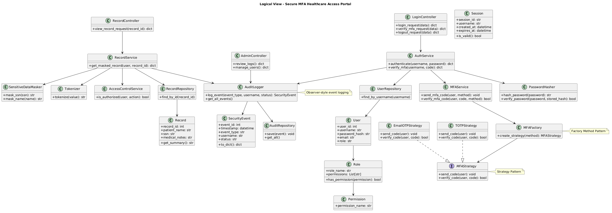
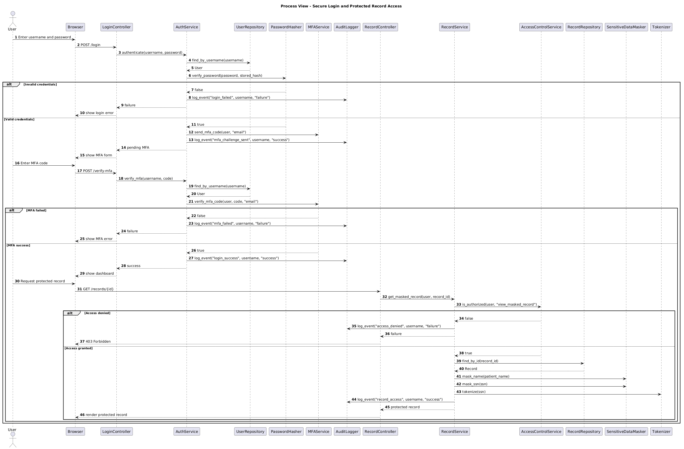
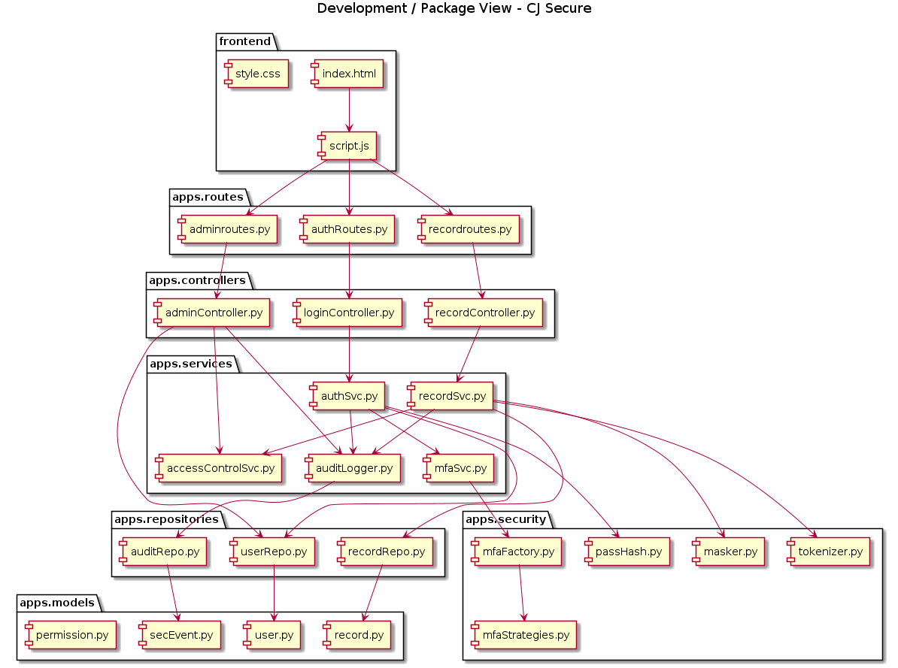
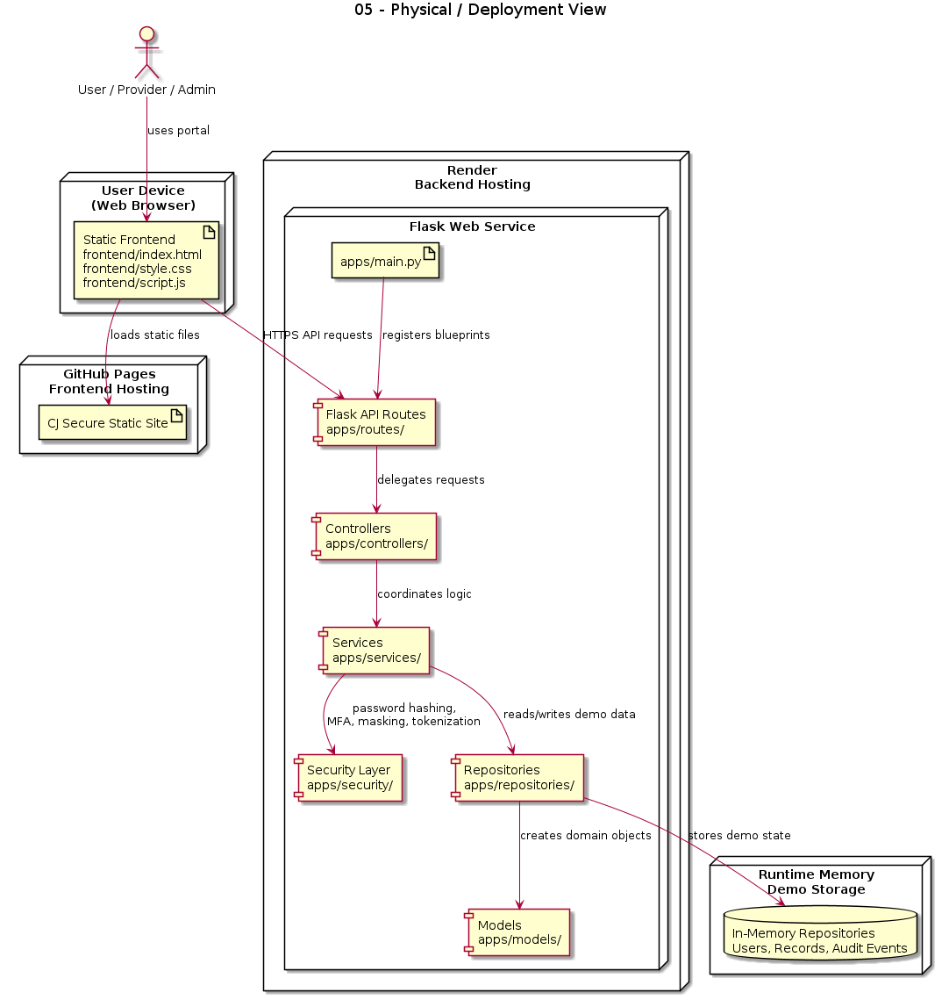

# CJ Secure
## Secure Access Portal for CJ Hospital

## Team Information
**Course:** CSCI 375 OOP and Design Patterns  
**Project Type:** Final Project / Student Showcase  
**Team Members:**  
- Lia “Chica” Gomes  
- Janet Griffin

## Overview
CJ Secure is a healthcare-focused security application designed for CJ Hospital. The system protects sensitive hospital-style information through layered security controls including username and password authentication, multi-factor authentication, role-based access control, audit logging, and secure handling of medical records.

The project demonstrates how object-oriented design can be used to build a modular, security-centered system for patients and providers in a hospital environment.

## Problem Statement
Traditional username-and-password authentication alone is not sufficient for systems that store protected medical or patient-related information. Weak passwords, unauthorized access, and poor audit visibility create major security risks in healthcare environments.

CJ Secure addresses that problem by implementing:
- secure username and password authentication
- multi-factor authentication
- role-based access control
- audit logging of security-related events
- masking and tokenization of sensitive identifiers
- protected access to hospital medical records

## Features
- Username and password login
- Multi-factor authentication
- Role-based access control
- Protected medical record retrieval
- Audit logging
- Sensitive data masking
- Sensitive data tokenization
- Flask backend API
- Static frontend for hospital-style demo usage
- Unit testing and property-based testing
- Dockerized backend setup

## Healthcare Demo Focus
CJ Secure is presented as a hospital security portal for CJ Hospital. The frontend experience is designed around two user perspectives:
- **Provider**
- **Patient**

The current backend demo account is:
The current backend demo account is:
- **Username:** `alice`
- **Password:** `password123`

After login, a verification code is sent to the registered email address for the demo user.

At the moment, the backend stores `alice` with an admin-level role, which makes that account best for provider or admin-style demonstrations such as secure record access and audit-log viewing.

## Architecture Overview
The project uses a layered object-oriented architecture.

### Backend
The backend is organized into:
- `apps/routes/` for API endpoints
- `apps/controllers/` for request coordination
- `apps/services/` for business logic
- `apps/repositories/` for data access
- `apps/models/` for domain entities
- `apps/security/` for hashing, MFA, masking, and tokenization

### Frontend
The static frontend is organized into:
- `frontend/index.html`
- `frontend/style.css`
- `frontend/script.js`

This frontend is intended to be served separately from the Flask backend. For deployment, the frontend can be hosted with GitHub Pages and the backend can be hosted on Render.

### Documentation and Evidence
- `Docs/Uml/` stores UML and design documentation
- `screenshots/` stores evidence of testing, execution, project management, and deliverables

## 4+1 Views
The software design is documented using 4+1 Views:

1. **Context / Use Case View**  
   Shows the main actors and their interactions with CJ Secure, including login, MFA verification, protected medical record access, and audit-log review.

2. **Logical View**  
   Shows the core classes, relationships, responsibilities, and object-oriented design of the system.

3. **Process / Sequence View**  
   Shows the runtime behavior of login, MFA verification, secure medical-record retrieval, and audit logging.

4. **Development / Package View**  
   Shows the modular code organization into routes, controllers, services, repositories, models, security helpers, tests, and docs.

5. **Physical / Deployment View**  
   Shows the deployment of a static frontend with a Flask backend API.

## UML Diagrams










## Object-Oriented Design Concepts Used
CJ Secure applies major OOD concepts from the course, including:
- abstraction through service and repository layers
- encapsulation through focused classes with clear responsibilities
- modularity through packages for routes, controllers, services, repositories, models, and security
- collaboration between objects for authentication, authorization, logging, and record access
- inheritance and abstraction through the MFA strategy interface and concrete MFA implementations

## Design Patterns Used
### 1. Strategy Pattern
CJ Secure uses the Strategy Pattern in the MFA layer through interchangeable MFA implementations such as email OTP and TOTP.

### 2. Factory Method Pattern
CJ Secure uses the Factory Method Pattern through `MFAFactory`, which creates the correct MFA strategy object.

### 3. Singleton Pattern
CJ Secure uses the Singleton Pattern in `AuditLogger` so that the system shares one centralized audit logger instance across authentication, authorization, and medical record access workflows.

## API Endpoints
### Authentication
- `POST /login`
- `POST /verify-mfa`
- `POST /logout`

### Records
- `GET /records/<record_id>?username=<username>`

### Admin
- `GET /admin/health`
- `GET /admin/audit?username=<username>`

## Project Structure
```text
apps/
  controllers/
  models/
  repositories/
  routes/
  security/
  services/
  main.py

frontend/
  index.html
  style.css
  script.js

tests/

Docs/
  Uml/

screenshots/

Dockerfile
docker-compose.yml
Makefile
requirements.txt
README.md

## How to Run

```bash
pip install -r requirements.txt
python -m apps.main

## Demo Instructions

### Backup MFA Demo Mode

For the class demo, the project can use the backup TOTP MFA strategy so the demo does not depend on email delivery.

```bash
export MFA_METHOD=totp
python -m apps.main 

tools we used for images and format : 
PicsArt background Remover , Chat GPT Image creator